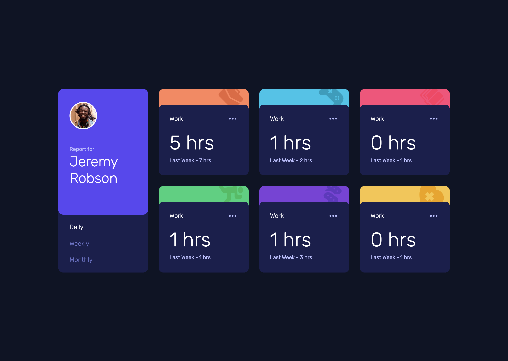
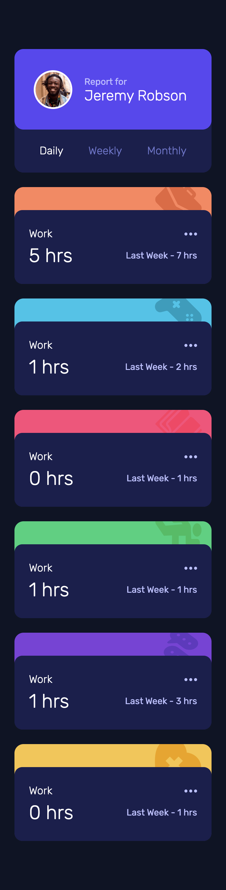

# Frontend Mentor - Time tracking dashboard solution

This is a solution to the [Time tracking dashboard challenge on Frontend Mentor](https://www.frontendmentor.io/challenges/time-tracking-dashboard-UIQ7167Jw). Frontend Mentor challenges help you improve your coding skills by building realistic projects. 

## Table of contents

- [Overview](#overview)
  - [The challenge](#the-challenge)
  - [Screenshot](#screenshot)
  - [Links](#links)
- [My process](#my-process)
  - [Built with](#built-with)
  - [What I learned](#what-i-learned)
  - [Useful resources](#useful-resources)
- [Author](#author)

## Overview

### The challenge

Users should be able to:

- View the optimal layout for the site depending on their device's screen size
- See hover states for all interactive elements on the page
- Switch between viewing Daily, Weekly, and Monthly stats

### Screenshot




### Links

- Solution URL: [Solution](https://github.com/andyjv1/Time-tracking-dashboard.git)
- Live Site URL: [Live](https://magnificent-khapse-13e536.netlify.app/)

## My process

### Built with

- Semantic HTML5 markup
- CSS custom properties
- Flexbox
- CSS Grid
- React


### What I learned

I learned how to use event.target.id so i can get the id of the stats when clicked (Daily, Weekly, and Monthly). I also learned how to use the ternary operator so i can changed the color of the text when the user switch stats.

```js
    const fetchtimeframe = async (event) => {
        const time = event.target.id
        setTimeframe(time)
        changeColor(time)
    };

    <h3 id="daily"
    onClick={(e) => fetchtimeframe(e)}
    style={{ color: active.daily ? "white" : " hsl(235, 45%, 61%)" }}
    >Daily</h3>
```

### Useful resources

- [How to Get the ID of the Clicked Element in the JavaScript Click Handler?](https://plainenglish.io/blog/how-to-get-the-id-of-the-clicked-element-in-the-javascript-click-handler-8ca398d848d6) - This helped me learn how to use event.target.id and this is what i am goin to be using in the future.
- [Conditional (ternary) operator](https://developer.mozilla.org/en-US/docs/Web/JavaScript/Reference/Operators/Conditional_operator) - This article help me understand the ternary operator. It is less code than to write an if-else statement

## Author

- Frontend Mentor - [@andyjv1](https://www.frontendmentor.io/profile/andyjv1)


